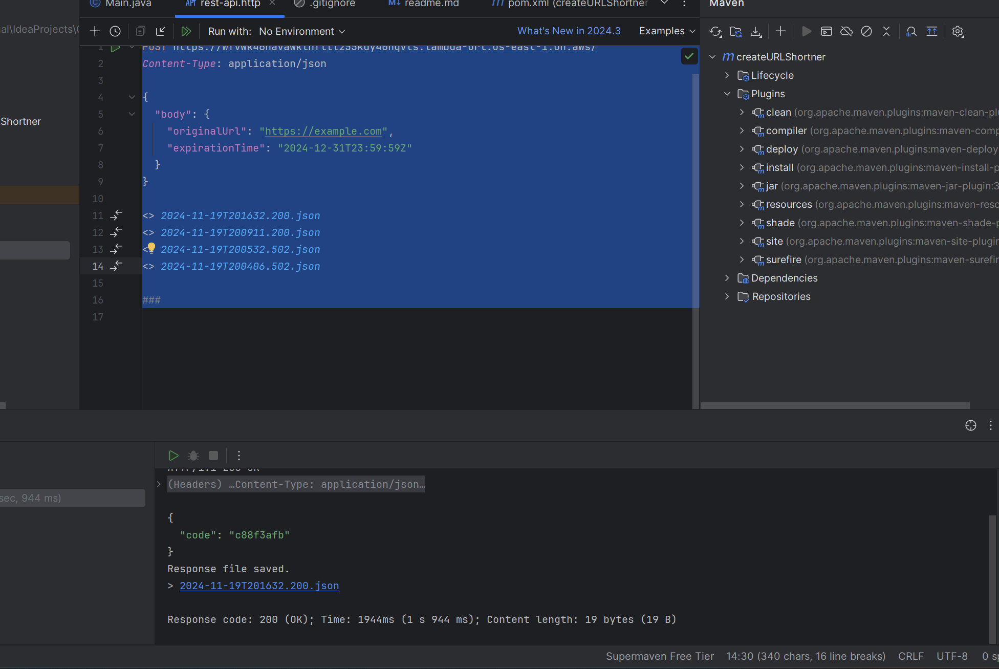

# Description

This is a simple REST API that takes a URL and returns a short URL.

# Building

To build the project, run the following command:

```
mvn clean
```

```
mvn package
```

# Deploying

To deploy the project, upload the generated JAR file to AWS Lambda.

# Endpoints

## POST /

### Request

```json
{
  "body": {
    "originalUrl": "https://example.com",
    "expirationTime": "2024-12-31T23:59:59Z"
  }
}
```

### Response

```json
{
  "code": "12345678"
}
```

# Screenshots



# License

MIT License © [Rocketseat](https://github.com/rocketseat-education/serverless-rest-api-example)